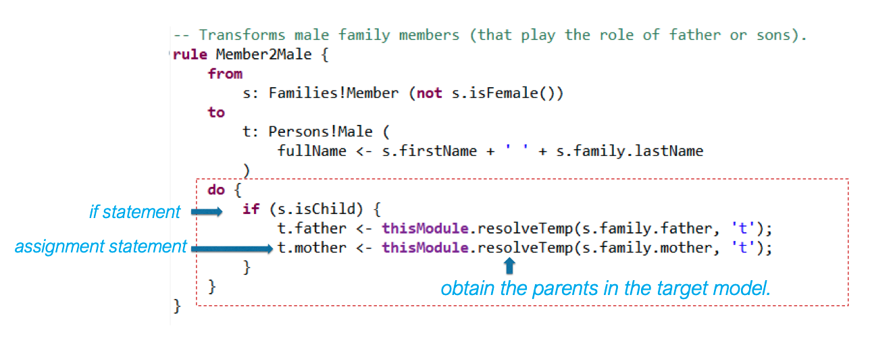
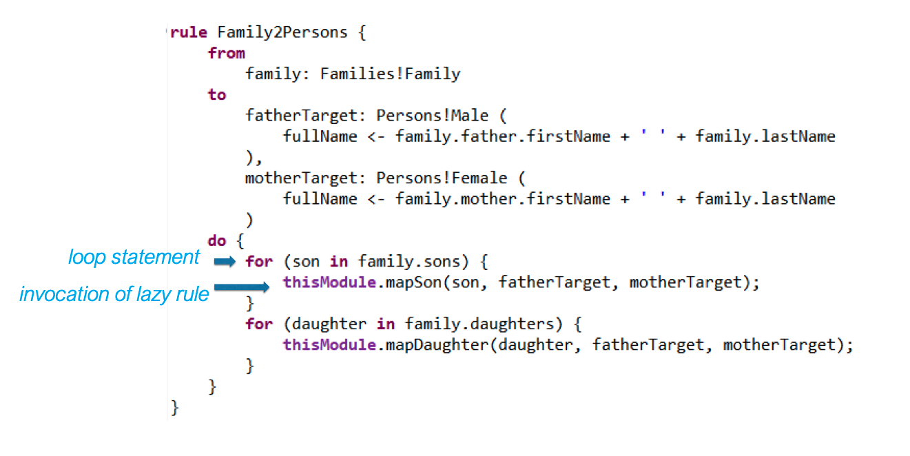
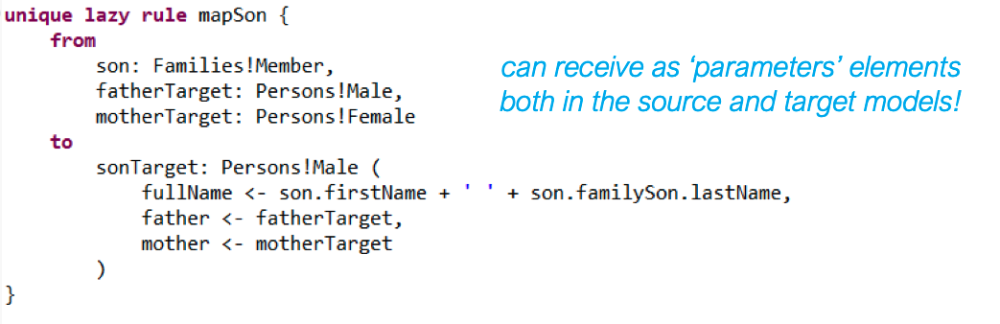

# Model-to-Model Transformations

- `Eclipse Modeling Framework` (EMF) proporciona a infraestrutura;

- `Atlas Transformation Language` (ATL) é usada para designar as regras de transformação entre modelos e para executar essas regras. 

- `Object Constraint Language` (OCL) é uma linguagem declarativa que é usada para pesquisa nos modelos com transformações em ATL. Usada quando as restrições dos modelos não são suficientes para digerir a complexidade da transformação;

- `EMF core metamodel` (Ecore) é a linguagem para definir os modelos source and target metamodels in transformations;  

- `XML Metadata Interchange` (XMI) é o formato usado para descrever o source e target model usados nas transformações ATL;

## ATL

Um model ATL define um conjunto de regras para transformar modelos noutros modelos. Tem a seguinte estrutura:

- O `header` define o nome do módulo, os inputs e os outputs;
- O `import`, que é opcional, permite exportar bibliotecas ATL;
- Podem existir `helpers`;
- Existem `rules`;

### Helpers

São query operations, possivelmente parametrizadas, no contexto de uma classe. Manipulam atributos derivados dessa classe e o corpo é na linguagem OCL;

### Rules

Definem as regras para a transformação de modelos noutros modelos. Podem ser de três tipos:

#### 1. Matched Rules

Permitem identificar regras usadas para gerar os target models. Suporta blocos imperativos (começados por `do`).

```ocl
rule rule_name {
    from
        in_var : in_type [(condition )]?
    [
        using {
            var1 : var_type1 = init_exp1;
            ...
        }
    ]?
    to
        out_var1 : out_type1 (
            feature1 <- exp1,
            ...
        ),
    out_var2 : distinct out_type2 foreach(e in collection)(
    feature2 <- exp2,
    ...
    ),
    ...
    [
        do {
            statements
        }
    ]?
}
```

A execução acontece em 3 fases:

- Module intialization: inicialização dos helpers attributes e execução da regra de entrypoint, se existir;
- Matching: alocar ao target model as matched rules, correspondendo ao source model os elementos que satisfazem as regras de matching;
- Target model initialization: inicialização dos elementos do target model previamente alocados, executando o código de *bindings*. Execução do código imperativo *do* das matched rules, possivelmente triggering a execução das lazy rules e das called rules. Esta fase permite a execução do seguinte código, para retirar o target element que corresponde a um source element:

```ocl
thisModule.resolvTem(source_element, target_pattern_variable);
```

Exemplo:



#### 2. Lazy Rules

Semelhantes às matched rules, mas têm de ser explicitamente chamadas por outras regras. São, no fundo, métodos auxiliares. `Unique lazy rules` sempre retornam um mesmo target element de outro source element.




#### 3. Called Rules

Precisam também de ser chamadas por outras regras, a menos que sejam declaradas como *entrypoint* or *endpoint*. Não possuem source patterns, apenas parâmetros.

## Constraints in OCL

- Domain constraints (possible values);
- Unique constraints;
- Related to loops in associations;
- Time constraints;
- Constraints that define derived elements;
- Existence rules;
- Generic busines constraints;

Example of equivalent domain constraits:

```ocl
context Booking inv:
    numberOfGuests > 0

context Booking inv:
    self.numberOfGuests > 0

context r : Booking inv:
    r.numberOfGuests > 0

context Booking inv NonZeroNumGuests:
    numberOfGuests > 0
```

Example of uniqueness constraints:

```ocl
context Booking inv: 
    Booking.allInstances->isUnique(number)

context Booking inv: 
    Booking.allInstances->forAll(b1, b2 |
        b1 <> b2 implies b1.number <> b2.number)
```

Example of business contraints:

```ocl
context Booking inv:
    numberOfGuests <= room.capacity

context Room inv:
    bookings->select(active)->size() <= 1

context Room inv:
    bookings->select(b | b.active)->size() <= 1
```

Example of loops constraints:

```ocl
// Uma pessoa não pode ser o seu próprio pai / mãe
context Person inv: 
    self.mother <> self

context: Person inv:
    self.father <> self
```