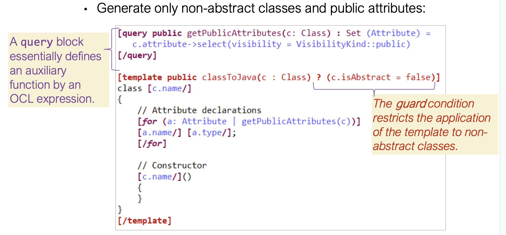

# Model-to-Text Transformations

O `Acceleo` é um gerador de código que usa um Model API do Metamodel correspondente para obter o output. 

### Desvantagens do processo:

- Não há separação do **static code** (package definition, imports...) e do **dynamic code** (class names, variables...);
- A estrutura de output não é simples de imitar a especificação;
- Não há uma query language declarativa (iteratrs, loops, type casts lidam desnecessariamente com uma grande quantidade de código);

### Vantagens do processo:

- Há uma separação muito clara do que é:
    - static code: simple text fragments;
    - dynamic code: using metamarkers;
- Metamarkers são placeholders que vão ser interpretados como templates dinâmicos para classes, attribute names, entre outros.
- A estrutura do output é bem definida usando os tais templates;
- A linguagem OCL também é usada na maioria das M2T transformations directives;

## Acceleo

Framework usada para M2T transformations, define um template para gerar o código de output e usa OMG (Object Management Group) standards. Suporta OCL.

